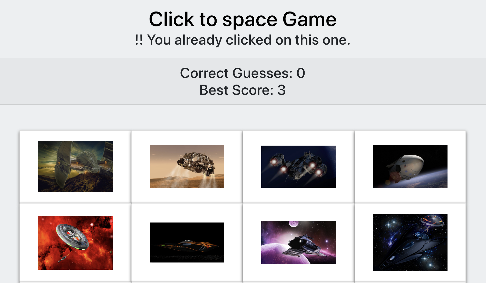

# Click to space Game
***

This is a react based web application that allows you to guess a random spaceship.  Once you select the spaceship, the position of all the spaceship with randomly change position.  The goal of the game is to get all 12 spaceship guessed without selecting the same spaceship! 

### How to play game

Click [here](https://beepritchard.github.io/click-to-space/)! to go to play game

### Technologies Used 
* React

#### Created by:
* Bee Pritchard - [GitHub](https://github.com/beepritchard/click-to-space)
